 
---

# TOL-API

1. Use the API to generate file upload/download commands
2. Token-based upload/download with time validation to prevent security issues

---

# Installation

```bash
$ pip install -r requirements.txt
```

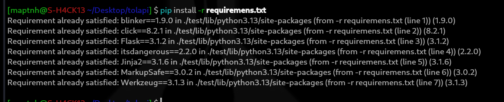

---

# Run

```bash
$ python tolapi.py
```

Copy the **Auth-Code** as your authentication token.

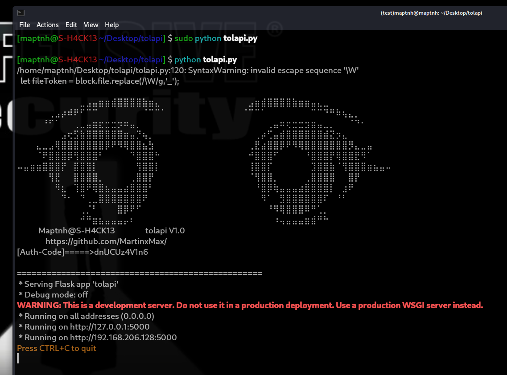

Access:
[http://127.0.0.1:5000](http://127.0.0.1:5000)

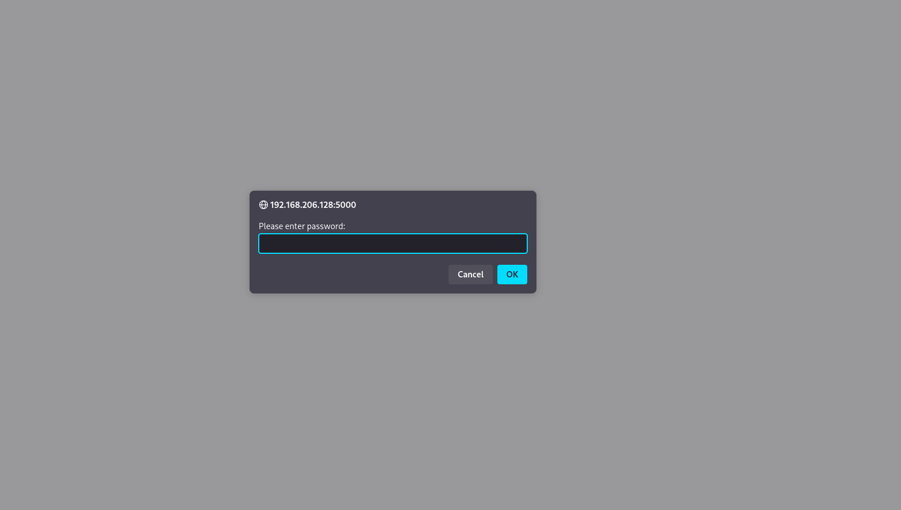

---

## Dashboard

The dashboard consists of **Upload** and **Download** sections, providing time-limited token-based file transfer.
This ensures that arbitrary file download issues will not occur.

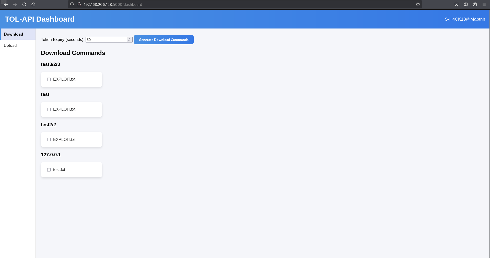

---

### Download API

Select the files you want to download, then set a valid download time (e.g., 60 seconds).

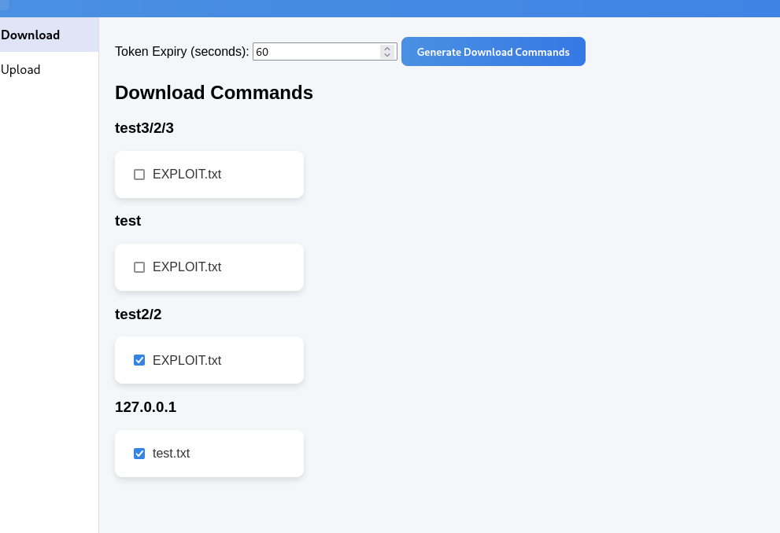

The system will generate shell commands for downloading.

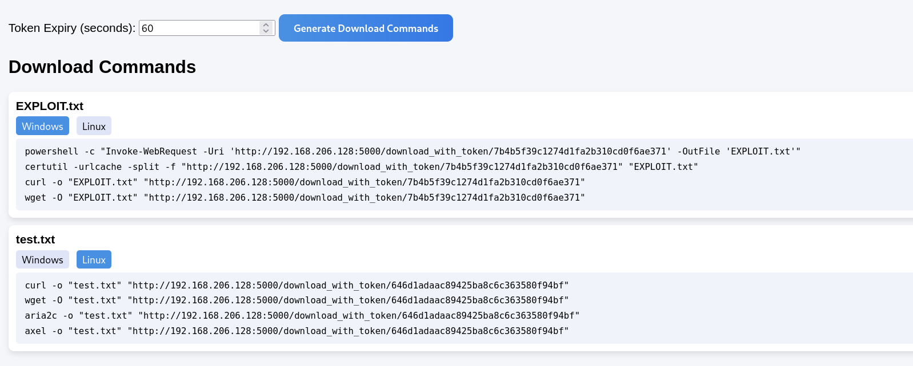

```powershell
powershell -c "Invoke-WebRequest -Uri 'http://192.168.206.128:5000/download_with_token/7b4b5f39c1274d1fa2b310cd0f6ae371' -OutFile 'EXPLOIT.txt'"
certutil -urlcache -split -f "http://192.168.206.128:5000/download_with_token/7b4b5f39c1274d1fa2b310cd0f6ae371" "EXPLOIT.txt"
curl -o "EXPLOIT.txt" "http://192.168.206.128:5000/download_with_token/7b4b5f39c1274d1fa2b310cd0f6ae371"
wget -O "EXPLOIT.txt" "http://192.168.206.128:5000/download_with_token/7b4b5f39c1274d1fa2b310cd0f6ae371"
```

Copy and execute any of these commands to download the file.

As long as the token is valid, the download will succeed.

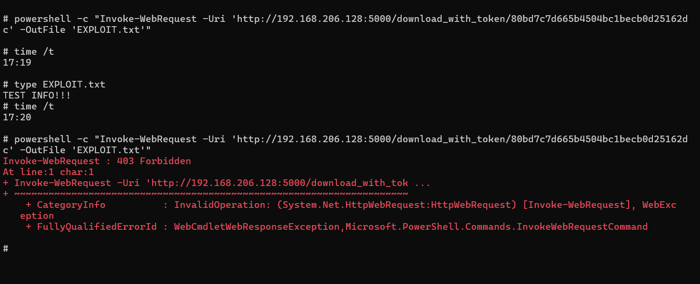

---

### Upload API

Example:

```bash
$ uname -a > /tmp/sys.info
```

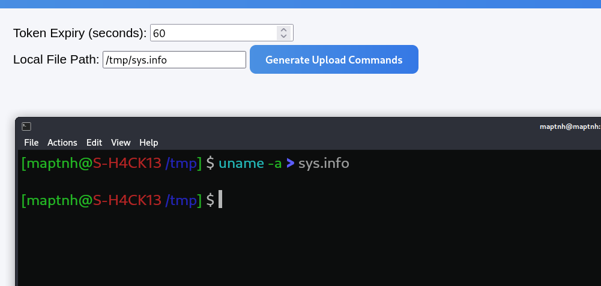

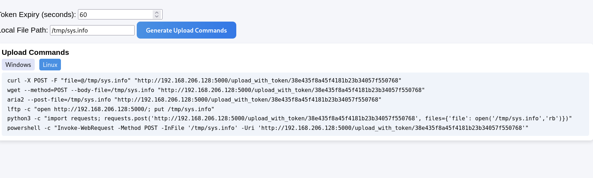

```bash
$ curl -X POST -F "file=@/tmp/sys.info" "http://192.168.206.128:5000/upload_with_token/38e435f8a45f4181b23b34057f550768"
```

Return to the **Download** page and refresh — you’ll see the uploaded file.

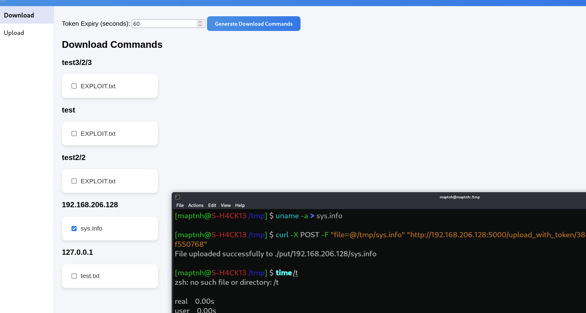

If the token has expired, the server returns **403 Forbidden**.

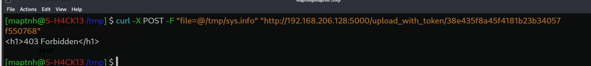

 
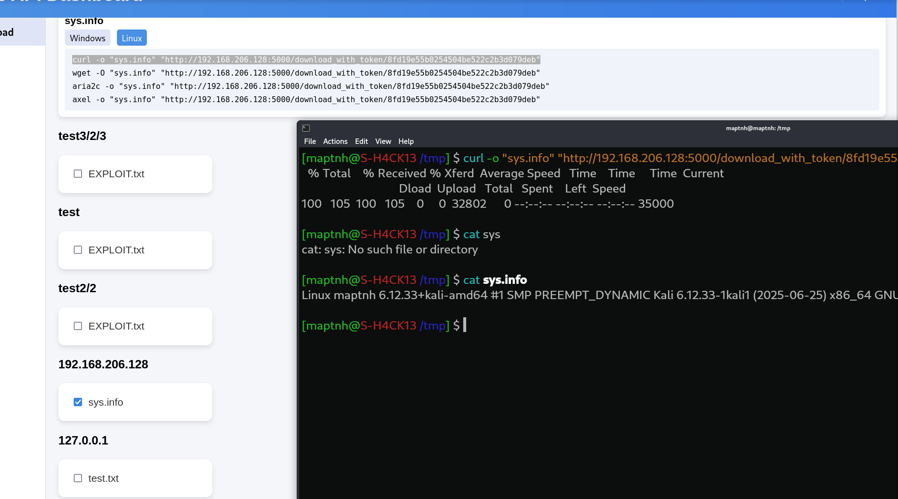

 